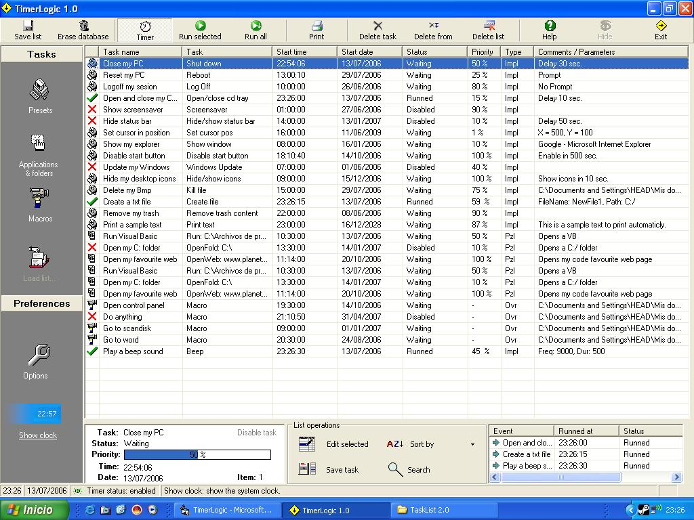



## TimerLogic 1\.0

### Description

This is an application that is made to run a PC tasks automaticly (previously configurated by user) without your presence.
 
### More Info
 

             |
---                |---
**Submitted On**   |2006-08-19 19:27:08
**By**             |[WessySource](https://github.com/Planet-Source-Code/PSCIndex/blob/master/ByAuthor/wessysource.md)
**Level**          |Intermediate
**User Rating**    |5.0 (40 globes from 8 users)
**Compatibility**  |VB 6\.0
**Category**       |[Complete Applications](https://github.com/Planet-Source-Code/PSCIndex/blob/master/ByCategory/complete-applications__1-27.md)
**World**          |[Visual Basic](https://github.com/Planet-Source-Code/PSCIndex/blob/master/ByWorld/visual-basic.md)
**Archive File**   |[TimerLogic2054193162007\.zip](https://github.com/Planet-Source-Code/wessysource-timerlogic-1-0__1-65975/archive/master.zip)

